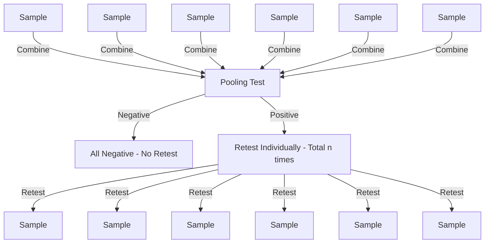

---
# You can also start simply with 'default'
theme: default
# random image from a curated Unsplash collection by Anthony
# like them? see https://unsplash.com/collections/94734566/slidev
# some information about your slides (markdown enabled)
title: Where Science 🔬 Can Take You

# https://sli.dev/features/drawing
drawings:
  persist: false
# slide transition: https://sli.dev/guide/animations.html#slide-transitions
transition: fade
# enable MDC Syntax: https://sli.dev/features/mdc
mdc: true
# open graph
seoMeta:
  # By default, Slidev will use ./og-image.png if it exists,
  # or generate one from the first slide if not found.
  ogImage: auto
  # ogImage: https://cover.sli.dev
layout: intro
overviewSnapshots: true
---

# Where Science 🔬 Can Take You
Piti Ongmongkolkul

---
layout: center
glowSeed: 123411
---

# About Me
- 🧑‍🔬 Physicist by training. 🎮 Gamer at heart.
- 👨‍🏫 Lecturer at Mahidol University International College for 10+ years.
- 🏢 Co-founder and Chief Research Scientist at The Gang Technology Co., Ltd.
  - A small 100 people software company.
- 🛒 Co-founder of Smart Retail Solutions.
  - A B2B platform for Wholesale and Retail focusing on FMCG.

---
layout: fact
glowSeed: 2ddddd
---

# What to do after you have a bachelor degree 🎓 in science?

--- 
layout: center
glowSeed: 3
---

---
layout: center
glowSeed: 10
---

---
layout: two-cols
image: /office_work.png
glowSeed: 2002
---

# Non-Academic Jobs
<v-click>

- 💰 Finance
- 📊 Data Scientist
- 🛠️ Engineer
- ✅ Quality Control
- 🛡️ Insurance
- 💻 IT
- 📈 Marketing
- 📋 Business Analyst
- 🏪 SME Owner
- 🧑‍💼 HR
- 💼 Business Consult
- 🎓 High School Teacher
- 🏥 Health Care
- 🪖 Military etc.

</v-click>

::right::

<v-clicks>

- ## 🌍 Huge Market.
- ## 🤩 Still get to do cool stuff. Might not be so cutting edge.
- ## 💵 Higher pay.
- ## 📍 You get to pick the location.

</v-clicks>

---
layout: image-right
glowSeed: 1223
image: https://upload.wikimedia.org/wikipedia/commons/0/06/Human_computers_-_Dryden.jpg
---

# Jobs that does not exists yet

- Calculator/Computer was an actual job title.
- Youtuber/Influencer does not exist 20 years ago.
- DevOp was not even a word 20 years ago. 
- Some will keep getting renamed with the same underlying skill set.
  - Operation Research → Financial Engineer → Data Scientist → Some other fancy names
  - DBA → Data Engineer → ML Engineer → AI Engineer -> ...

---
layout: fact
---

# Publish X papers a year.
Some of you will. Most of you won't.

---
layout: center
glowSeed: 223
---

# Why did we study Physics/Math/Biology etc.?

<v-click>

# Because it's easy...right?

</v-click>
---
layout: center
glowSeed: 20002
---

# Because it has a lot of applications? {.view-transition-easy}

- Physics: Engineering, Technology, Medical Imaging
- Math: Data Science, Cryptography, Finance
- Biology: Medicine, Environmental Science, Biotechnology

---
layout: image-right
image: /dr_stone.png
glowSeed: 1234
---

# Because of some romantic reasons? {.view-transition-easy}

<v-clicks>

- Discovering the Law of Nature.
- Make the world a better place.
- One of Stephen Hawking book: eg. Brief History of Time.
- An anime: Dr. Stone
- Idol: Einstein & Elon Musk
- Challenge.
- Fun. Thanks to your high school teachers.

</v-clicks >

---
layout: image-left
glowSeed: 123
image: /lab.png
---

# How did we learn?
<v-clicks>

- Problem sets
- Lab Reports
- Presentations

</v-clicks>

---
glowSeed: 3922
---

# What we really learn?

  

  
  ## Fearless of the unknown
  - We approach really difficult problems on a daily basis.
  - We learn to live with the feeling of being stupid or lost.
  
  

  

    
  ## Spotting patterns and correlations
  - Gather all the fundamental laws to solve problems.
  - Formulate fundamental mechanisms from the patterns we find.
  
  

  

  ## Quantitative reasoning
  - Call it what you want: Math, Statistics, Data Science, etc.
  - Formulate problems in quantitative ways.
  
  

  

  ## Communication skills
  - Teaching your friends the homework.
  - Asking the right questions.
  - In fact, a large part of managerial work is communication.
  
  

---
layout: center
glowSeed: 2234
---

# Our Very Unique Offer: First Principle approach.

- Rich People
  - Problem? → Money → Fix
- Other People
  - Problem? → Look up known solution → Fix.
- First Principle's Approach
  - Problem? → Look up known solution/Figure out the underlying mechanism → Fix
  - Bonus: Figure out the underlying mechanism → Abusable.

---
layout: center
---

# Science Major
- Among the best in the industry at solving unknown problems.
- Most problems in the industry are not by the book, even if they aren't cutting-edge.
  - When was the last time you saw a spherical conductor?
  - New constraints, modified objectives, etc.
- We are permanently wired to think this way.
  - Once a scientist, always a scientist.

---
layout: fact
---

# Does the industry know this?
Yes, they do. Sort of.

---
layout: image
---

<v-drag pos="229,126,427,43"><h2>Hired to solve technical problems.</h2></v-drag>

---
layout: fact
glowSeed: 1231232
---

# Hurdles 🚧
Given that the system is not perfect. 🤷‍♂️💡

---
glowSeed: 55522
---

  

  
  ## Be Open
  - Academia isn't the only path. Even in academia, changing field is OK.
  - There is nothing wrong with job not directly related to your degree.

  

  

  ## Job Listing
  - Most don't list physics as the major they want. But, apply anyway if you seem to be able to contribute.
  - Most people that hire physicists are either physicists themselves or word of mouth.

  

  

  ## Present yourself
  - Yes you feel stupid all the time. But, you are not stupid.
  - Show it in your Resume/CV/Interview that you have unique offer.
  - Be smart but not smartass.

  

  

  ## Communication is key
  - Emphathy.
  - Your know something that they don't.
  - They don't know something you do.
  - You still need to be able to explain to them to get them up on the same speed/buy your argument.

  

---
layout: fact
---

# Did we waste time with a hard science degree?
Why not just study a more "direct" major?

---
layout: center
glowSeed: 3333
---

# But I thought that XXX job is for YYY major?

- ## Jobs require skills not degree. 🛠️🎓
  - Some do require degree by law. Ex: Doctor. ⚖️👩‍⚕️
- ## As an employer, we hire people for their skills not degree.

---
layout: fact
glowSeed: 1234
---

# Secret
## There is no real "direct major". {v-click}

---
layout: image-right
image: /pcr.png
---

# Late night during the covid pandemic
- RT-PCR were quite expensive early on. 
- Positive proportion was typically very low. Most were gonna be negative.
- Pooling (put multiple people in the same tube) might save costs.
  - If anyone in the pool is positive, the tube is positive, and we will retest them individually.
  - If the tube is negative, everyone is negative.
- How many people should we put in a tube?

---
glowSeed: 9393939
---

---
layout: image-left
image: /accelerator.png
glowSeed: 9999
---

# Looking at myself.
- Problem involves PCR. He is not a biologist.
- PCR has test tubes and a bunch of chemicals. He is not a chemist.
- It has to do with probability. He is not a statistician.
- It has to do with optimization. He is not a mathematician.
- How many of this combo are there? 
  - Biologist+Chemist+Statistician+Mathematician
- But we can solve the problem.
  - With our first principle approach.

---
glowSeed: 239444
layout: center
---

# It's not that hard.
- $n$ people in total.
- Each tube has $m$ samples.
- Each person has probability $p$ of being positive.
- We know that the major effect has to do with these three numbers.

---

# Let us reason

$$ {0|1|2|3|4|none}
\begin{align*}
PCR &= \frac{n}{m} + m \times \text{\# group positive} \\
E[PCR] &= E \left[ \frac{n}{m} \right] + m \times E\left[ \text{\# of group positive} \right]\\
&= \frac{n}{m} + m \times E\left[ \text{\# of group positive} \right] \\
&=  \frac{n}{m} + \underbrace{n \times (1- (1-p)^m)}_{n \times (1-P(\text{everyone negative}))} \\
\end{align*}
$$

$$
E[PCR] = \frac{n}{m} + n \times (1- (1-p)^m)
$$

<v-after>
  
- Number of PCR tests is a function of group size $m$.

</v-after>

---
layout: center
glowSeed: 12345633
---

<v-clicks>

$$
E[PCR] = \frac{n}{m} + n \times (1- (1-p)^m)
$$
This means all we need is to minimize this with respect to $m$.
$$
\frac{d}{dm}E[PCR] = 0
$$
Well differentiate exponential is quite annoying. Hello Taylor series.
$$
E[PCR] \approx \frac{n}{m} + n \times (1- (1-mp))
$$
$$
\frac{d}{dm}E[PCR] = -\frac{n}{m^2} + n \times p = 0
$$
$$
m = \sqrt{\frac{1}{p}}
$$
</v-clicks>

---
layout: fact
glowSeed: 1232341
---

# Real problems are interdisciplinary.
## Understand then Abuse skill is generalizable.

$\int^1_0 x^2 dx$

Solve the Schrödinger equation for infinite square well.

But you can still do it if you want to.
You may not feel comfortable. I blame textbooks.

---
layout: center
glowSeed: 777777
---

# Tire Reliability Problem 🚛🛞

- Suppose you work at a logistics company. 📦
- Feels like you're spending too much on tires. 💸

<v-click>

- What do you do? 🤔
  - Spend more money to solve the problem? → Vendor says so. 🛍️
- You have a set of data (pressure, tire life). Can you "predict" the lifetime of a tire given its pressure/brand? 🔮📊
  - Match it with a known problem → Regression. 📈
  - Actually understand the problem → It's a random process. 🎲
- What if the tire runs at different pressures all the time? 🤷‍♂️

</v-click>

---
glowSeed: 66666
---

# The truth is...

  

  
  ### Degree name VS Skill name

  - Quantitative Analysis with concentration in Fundamental Laws of Nature, we would have less questions.
  
  

  

  ### Learner vs One Trick Specialist
  - Don't put all your eggs in one basket.
  - Given rapidly changing world, the choice is clear.

  

  

  ### Everyone Relearns
  
  - PCR Pooling problem. Anyone trained specifically to solve this?
  - We did things in hard mode. (And we love feeling stupid all the time).
  
  

  

  ## Quantitative Reasoning
  - Needed for a foreseeable future.
  - Skills for using specific tools or performing specific tasks do not age well.

  

---
layout: fact
glowSeed: 89362
---
# 🤔
## Can we make a science degree  better for the non-academia path 🔬💼?
They are the majority after all.

---
layout: image-left
image: /knowledge_and_skills.png
glowSeed: 111122
---

# What We have

- Strong analytical skills 🧠
- Basic programming knowledge 💻
- Good communication skills 🗣️

::br 
# What We don't

- Working on a team 🤝
- Project management 📋
- Work with customer 🛠️
- Managing Budget 💰

---
layout: two-cols-header
glowSeed: 639202
---

# Stuff that complements your science degree in non-academia world.

::left::
<v-clicks>

- ## Adapt or Die.
  - Expand your horizon, just in case.
  - If we don't disrupt ourselves, someone else will.
- ## Programming.
  - Most real-world problems are not grounded spherical conductors.
  - Get the computer to do it for you. (In general, be lazy and use technology to your advantage.)
- ## English.
  - Most human knowledge is transferred/kept in this language. If you are locked in Thai, you are at a disadvantage.

</v-clicks>

::right::

<v-clicks>

- ## Teaching and Communication to Non-Scientists.
  - Our problem sets are typically individual work.
  - In the real world, you work as a team with people of different skills.
- ## How the Business World Operates.
  - Try starting a business (online shop, etc.), tutoring for money, etc.
  - Put more context on the problem.

</v-clicks>

---
layout: fact
---

# What do I do if my school doesn't teach this?

<v-click>

You can learn them on your own. It's now easier than ever.

</v-click>

---
layout: intro
glowSeed: 12345673
---

# Key Takeaways

<v-clicks>

- 🌟 Be open to non-academia opportunities.
- 🛠️ Focus on those generalizable skills.
- 🚀 Keep Moving+Improving. The world changes rapidly.

</v-clicks>

---
layout: fact
glowSeed: 83232
---

# OK, Non-Academia is not so bad after all. But,...
## 🤖 AI is taking my jobs. 😱

---
layout: fact
glowSeed: 9933322
---

# Were dinosaurs🦖 physically weak?

<v-click>

No one can adapt better than us.

Analytic 📊
Programming/Automation 🤖
Communication 🗣️
</v-click>

---
glowSeed: 92932
layout: fact
---

# AI raises the floor not the ceiling. 🚀

(Not yet anyway.)

Just don't be at the floor. 

---
layout: fact
glowSeed: 12345678343
---

# Questions? 💬

